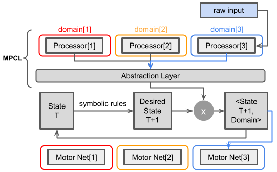

In my opinion, the hardest problem in CL (continual learning) is detecting domain boundaries.
Once you know what the current domain is, e.g. car driving, you can route the inputs to specialized networks and take the appropriate action in a domain-aware manner.
You cannot readily train a model to detect domain boundaries though.
Such a model would have to be *continually* trained, so you would be stuck in a vicious circle where you would need CL to solve CL.

In [MPCL](https://github.com/rom1mouret/mpcl), I proposed two research avenues:

- making pattern recognition more like one-class classification by the means of "triangular" activation, thanks to which out-of-domain data is more likely to produce noisy outputs, as opposed to sharp, confident outputs. This isn't too far off from density estimation, SVDD and Bayesian networks.
- detecting discrepancies at the most abstract levels of the system. In theory, the correct domain is the domain giving rise to the lowest number of discrepancies.

I believe the latter approach has good potential but it is difficult to test it on small systems as they lack structure and sparsity.

## Proposed CL Architecture

In keeping with MPCL, I will separate input processors and goal-realizing networks.
Processors map raw inputs to an abstraction layer that is shared across all goal-realizing networks.
Processors *interpret* the inputs, so to speak.
The system is said to *abstract* raw inputs in that the system can execute the same goal-realizing network irrespective of the input domain,
thus it is the downstream goal-realizing networks that define the abstraction layer, not the processors.
Processors and goal-realizing networks get to be independently trained without interference [once a large enough number of domains have been observed](https://github.com/rom1mouret/mpcl/blob/main/MPCL_v1_slides.pdf).

The proposed architecture differs from MPCL in one important aspect:
the execution flow no longer starts from sensory inputs.
Instead, it starts from a symbolic circuit mapping the current abstract state to the desired next state.
Then, knowing what the desired state is, the system tries to find a good match with the outputs of one of the processors.
Here, the role of the processors is not to control the agent in a traditional sense (from input to action), but to check whether the desired next state makes sense from within the domains the processors operate in.
After selecting the domain for which the state(T+1) makes the most sense, the agent executes the desired action via a domain-specialized network.

  

#### Example

| Action     | Symbolic Circuit | Domain1's Processor | Domain2's Processor |
|------------|------------------|---------------------|---------------------|
| MOVE LEFT  | 95%              | 10%                 | 70%                 |
| MOVE RIGHT | 4%               | 80%                 | 0%                  |
| STAY STILL | 1%               | 10%                 | 30%                 |

The agent wants to move left.
The system first attends to the sensory inputs using Domain 1's processor. 95% x 10% = 9.5%, so moving left under Processor1's interpretation is not ideal.
Upon attending to the inputs with Domain 2's processor, the system calculates that Domain 2 is a better match (95% x 70% = 66.4%).
In this configuration, the agent will move left using a network specialized for Domain 2.

If neither processor is compatible with a move to the left, the second most desired action MOVE RIGHT is considered, and so on.

Note: it is not a typical attention mechanism because processors are not trained as attention filters.
This would not be possible without falling into the vicious circle mentioned earlier.

## Proof of Concept

Unlike my previous projects, the proposed architecture only works in a RL setting.
It would be a lot of work to implement all the required modules with SOTA performance, so I will focus the PoC on what I believe is the problem that gets the least attention: detecting domain boundaries.

To that end, I invented a small game that replicates the relevant properties of an active setting.

#### Permuted MNIST Mini Game

The goal of this game is to increment a digit.

If the current state is `N`, the agent should draw a representation of `(N+1)%10`, which in turn can be read by the processors at the next iteration.
For instance, if the current state encodes the number 3, the desired next state should encode 4 and the agent should draw an image of 4.
It should be able to do so for any known permutation of the pixels, as in the original [Permuted MNIST setup](https://paperswithcode.com/dataset/permuted-mnist).

Because the game is so simple, one can conveniently hardcode most of the modules.

- I posit that the abstraction layer is made up of 10 units, where each unit corresponds to a digit. This is the optimal abstraction for this problem. In this way, processors can be trained as softmax classifiers (this is not how they should be trained in the general case though).
- The hardcoded symbolic circuit calculates `N+1` from `N`, where `N` is the previous state of the abstraction layer.
- The drawing networks map a pair (`(N+1)%10`, permutation task number) to a suitably permuted image of `(N+1)%10`. This can be readily implemented by storing some prototypes for each pair.

We are left with a minimal task.

- Detecting the permutation task number knowing the expected digit `(N+1)%10` and the image of the last drawn digit.

This contrasts to MPCL's PoC, which had to do more with less information:

- Detecting the permutation task number *and predicting* the expected digit, given the image of the last drawn digit.

### Results

To solve the problem, it is sufficient to run each processor on the current digit image and pick out the processors that correctly predict the next digit.
If multiple processors happen to make the right prediction, we pick the processor with the highest confidence.

As a baseline, domains will be detected based on the confidence (= max probability after softmax) of each classifier, not knowing the expected digit.
The domain with the most confident classifier is the domain we choose.

| Baseline   | This Project |
|------------|--------------|
| 41.9%      | 87.6%        |

(domain selection accuracy [with 10 domains])

Reproduce with: `python3 experiment.py`

Note: classifiers are trained with `LeakyReLU` rather than [Triangular activations](https://github.com/rom1mouret/mpcl).
Any improvement of the baseline, e.g. Bayesian networks or entropy-based confidence metric, is likely to improve the proposed method as well.

### Symbolic Circuit

While processors are best implemented as neural networks, MPCL imposes no constraint on the nature of the other modules.
In this project, as mapping abstract symbols to abstract symbols is inherently the job of a pure symbolic approach, I suggest fulfilling this function by incrementally building an old-fashioned symbolic program.

It is tempting to dismiss my method on the basis that training a symbolic circuit is the hardest part of my proposal, but once we enter the discrete realm, some difficulties with continual learning actually become easier to overcome, namely

- Memory replay scales better since it is relatively cheap to store abstract symbols compared to storing raw signals.
- It is easier to count bits of experience and build the resulting probability distributions.
- Refining knowledge is largely a matter of adding symbolic observations, without the risk of catastrophic forgetting (more on this later).
- It makes it possible to train new processors with unambiguous targets.
- It can serve as a logical structure to detect discrepancies.

What is usually viewed as a hard problem is to conjointly train neural networks and symbolic AI.
MPCL already addresses this issue to some extent as it explicitly builds an abstraction layer that is meant to withstand the test of time, separating processors and downstream abstract-representation-manipulating modules.
Not only that, but the processor outputs don't need to be discrete for us to measure their compatibility with discrete internal states.

In further work, I will focus on this symbolic module.
MPCL allows us to add new tasks and new processors, but it doesn't allow adding new *abstractions*, so I am considering letting new processors create new abstractions and aligning abstractions in an ad-hoc fashion.

### Caveats

Like MPCL, the proposed architecture falls short of being biologically plausible, for at least two reasons.

- training a different processor for every situation is not realistic. Some compute/memory overheads can be reduced by sharing weights between processors, but what we really need is a hierarchical architecture.
- living organisms can have their attention mechanism bypassed by raw inputs, following a conventional `raw input → control` flow, for example in the presence of danger.
